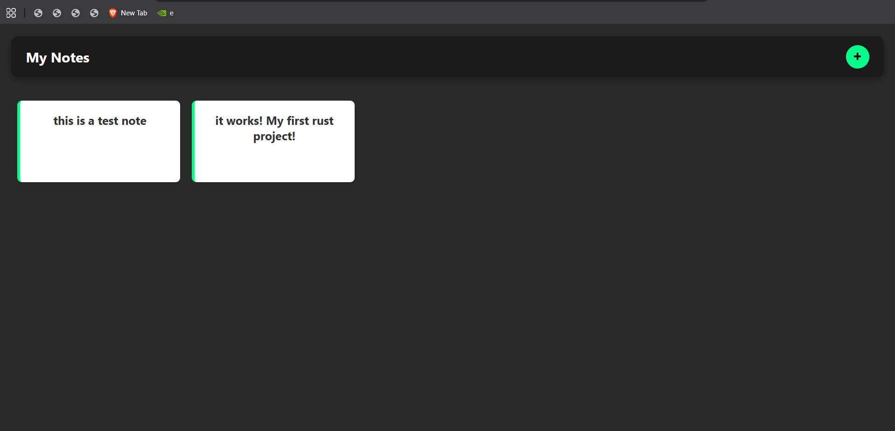

# 📝 Rust Notes Server

> **My first Rust project** — a fully hand-crafted HTTP web server built from scratch using only Rust's standard library, serving a sleek notes-taking web app.

<br>



<br>

## ✨ What Makes This Special

This isn't a framework app. There's **no Actix, no Rocket, no Axum** — just raw TCP sockets, byte buffers, and Rust's standard library doing all the heavy lifting. Every HTTP request is parsed by hand, every response is formatted manually. It's the real deal.

---

## 🚀 Features

- 🔌 **Raw TCP Server** — built on `std::net::TcpListener`, zero web frameworks
- 🧵 **Multi-threaded** — each incoming connection spawns its own thread via `std::thread`
- 📋 **REST-like API** — supports `GET /api/list` and `POST /api/add`
- 💾 **JSON Persistence** — notes are saved to `data.json` and survive restarts
- 🌐 **Serves its own frontend** — `index.html` is served directly at `GET /`
- ⚡ **< 100 lines of Rust** — clean, readable, no dependencies except `serde`

---

## 🛠️ Tech Stack

| Layer | Technology |
|---|---|
| Language | Rust (2024 Edition) |
| HTTP Transport | `std::net::TcpListener` / `TcpStream` |
| Concurrency | `std::thread` (one thread per connection) |
| Serialization | [`serde`](https://serde.rs/) + `serde_json` |
| Frontend | Vanilla HTML + CSS + JavaScript |
| Data Storage | `data.json` (flat file) |

---

## 📁 Project Structure

```
webserver/
├── src/
│   └── main.rs       # TCP server, request router, and API handlers
├── index.html        # Frontend UI (notes app)
├── data.json         # Persistent note storage
├── Cargo.toml        # Project manifest & dependencies
└── Cargo.lock        # Locked dependency versions
```

---

## ⚙️ Getting Started

### Prerequisites

- [Rust](https://www.rust-lang.org/tools/install) (stable) — install via `rustup`

### Run the server

```bash
# Clone the repo
git clone https://github.com/nqtexd/Rust-Notes-Application.git
cd webserver

# Build and run
cargo run
```

The server starts on **`http://127.0.0.1:8080`** — open it in your browser and start taking notes.

---

## 🔌 API Reference

### `GET /`
Returns the frontend (`index.html`).

### `GET /api/list`
Returns all notes as a JSON array.

**Response:**
```json
[
  { "id": 1, "content": "this is a test note" },
  { "id": 2, "content": "it works! My first rust project!" }
]
```

### `POST /api/add`
Adds a new note. Sends JSON body, returns the full updated list.

**Request body:**
```json
{ "id": 0, "content": "Your note text here" }
```

**Response:** Updated `[{ "id": ..., "content": "..." }, ...]`

---

## 🧠 How It Works

```
Client Request
     │
     ▼
TcpListener::bind("127.0.0.1:8080")
     │
     ▼
thread::spawn()  ← one thread per connection
     │
     ▼
Read raw bytes from TcpStream
     │
     ▼
Parse HTTP method + path manually (split on "\r\n")
     │
     ├── GET  /         → serve index.html
     ├── GET  /api/list → read data.json → respond with JSON
     └── POST /api/add  → parse body → append to data.json → respond
```

No routing framework. No middleware. Just Rust.

---


## 📖 What I Learned

Building this taught me:

- How **HTTP really works** at the wire level (headers, CRLF, Content-Length)
- Rust's **ownership model** in a real async-ish context (threads + `move` closures)
- How to **parse raw byte streams** safely with `from_utf8_lossy`
- Using `serde` + `serde_json` for clean **serialization/deserialization**
- Why frameworks exist — and also why you should build without them first

---

## 🗺️ Possible Next Steps

- [ ] Add DELETE endpoint to remove notes
- [ ] Replace flat-file JSON with SQLite (`rusqlite`)
- [ ] Move to async I/O with `tokio`
- [ ] Add proper HTTP error responses (404, 400, 500)
- [ ] Containerize with Docker

---

## 📜 License

MIT — feel free to learn from it, break it, and build on it.

---

<div align="center">
  <sub>Built with ❤️ and a lot of <code>unwrap()</code> — my first Rust project 🦀</sub>
</div>
